## Player and NPC

We are ready to add some characters. Our NPC will be simple. Our player will move and be animated.

Open Defold and open the main collection.

Because this is a learning project lets add the NPC in the simplest way. Then we'll add the player in a reusable way.

**NOTE - SAVE OFTEN** using *Ctrl-S*

### NPC
We'll add this NPC directly to the scene. So on the right in the *outline pane* lets add another game object to the collection. You may name it *npc* or *mayor*. Add a sprite component to the mayor.

Now we need the sprite to have the image of the mayor so lets open the assets.atlas and make sure we have a good image for the mayor. Add an image to the altas ~ use female.idle, or whichever you have for the mayor.

Go back to the main collection in the editor tab, and then select the mayor sprite on the *outline* and add the atlas and select the new sprite image we just made.


In the *outline* be sure to select the game-object *mayor* and then move the mayor (not just her sprite) to stand in front of the library. We could have labeled one of the buildings town-hall or mayors-office. Let her stand in the middle of the sidewalk so we can move around her later.

The mayor is visible because her z position is more positive than the other sprites.

### Lets add the player.
Create another atlas the way you did for the first and give it the name player.
+ add a image to the *Atlas* player_01
+ Add three animation groups to *Atlas* name them *up*, *down*, and *horizontal*.
+ Right click *down* add the images player 05,06, and 07
+ Add images to the other two groups, 11,12,13 to *horizontal* and 08,09,10 to *up*.

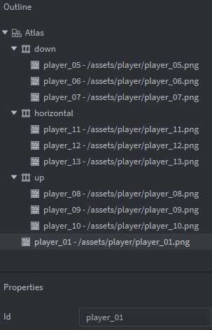

On the left pane or *Assets pane* right-click main and add another collection. This time call it player. Collections can be added to other collections. We'll add this to main later.

Open the player.collection by double clicking.
on the right in the *outline* add a game object and call it *player*.
right-click the game object and add a sprite.
Add the player atlas to the sprite. you may choose player_01 as the animation for now. When you do that you may need to zoom out to see the player. Save.

Select the main collection in the *Editor pane*. In the *outline pane* right-click collection and add a *collection file* 

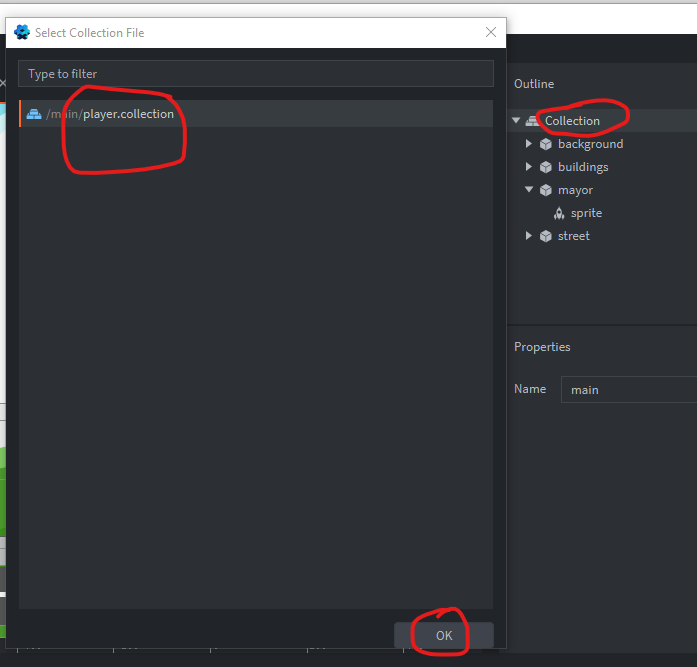

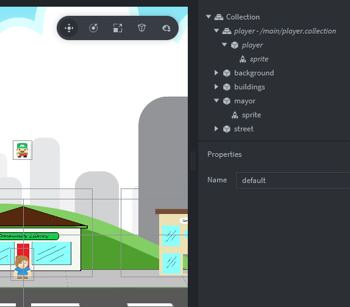

Lets move the player. Select the player collection in the main.collections *outline* and move it in front of the hospital.

Ok the Player and the Mayor seem to lack proportion. This is because the sprite images were not proportioned in the same way by the artist. We can scale the mayor or we can scale the player or both.

Select the Mayors game-object and change the sacel to x 0.7 and y 0.8

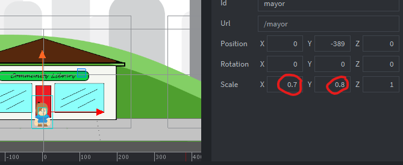

Now select the players collection and scale the player. x 0.9 and y 1.1. This means the player will need to be scaled to each collection it is added i.e. when we have different settings later.

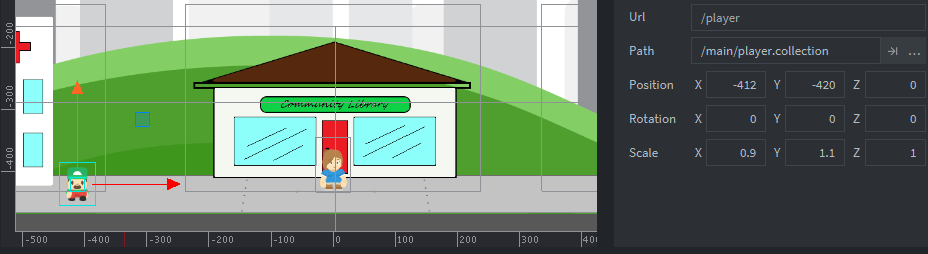

you can use other sizes to look have it look less goofy.

So why do we scale the object or collection and not the sprite. Well I wanted everything to be scaled and didnt want to scale anything inside so its easier to add things later. You may want the sprite to be scaled only. It does produce different results so you choose what you scale and then play test it. (however they should be more complete to do actual play testing).

### OUR FIRST CODE - WOOHOO

ok to get or player to move we will want to add some code. 
NOTE: our code in in *Lua*. Read it as if it were english for now.
-- is a line comment - i.e not code, but a note for the reader.
--[[  --]] surrond a comment block
We have more info for Lua in the back of the book for you to refer to. 

We have a descision to make.
 + Do we want to use our keyboard WASD or arrow keys.
 + Do we want point and click.
 + How about both?

Lets add our keys to the input bindings so we can use them in code.

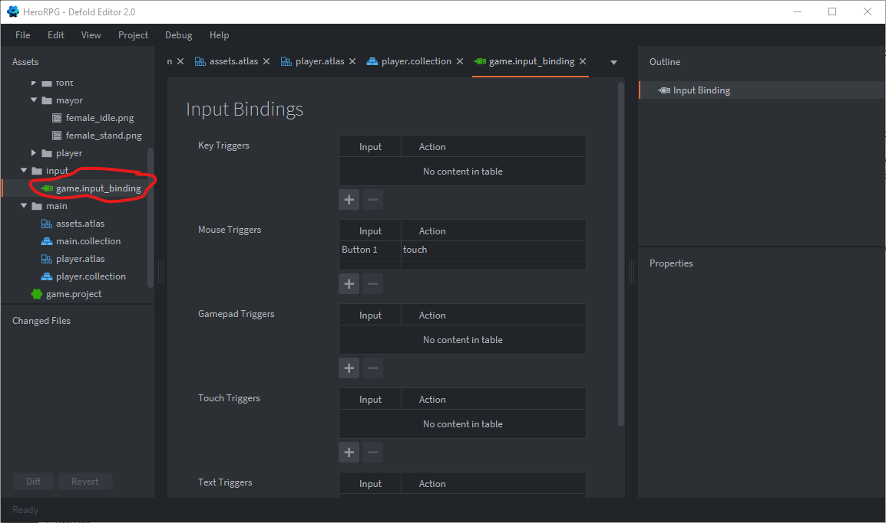
Double-click the input/game.input_binding to bring up the bindings screen.


Now add the arrow keys and WASD keys to the input bindings. *+* to add, *arrow* to select key, and type in the name you want to use to check against in the code.

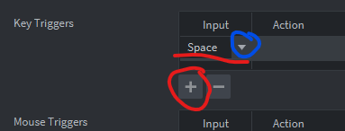

The Keys added.

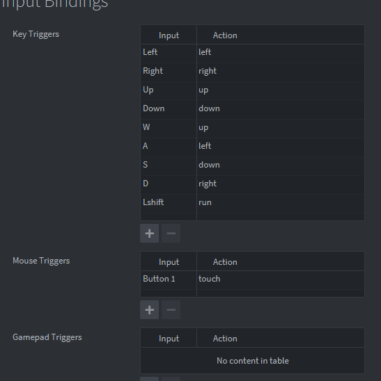

Defold examples, tutorials, and manuals have a lot of info. Lets grab a piece of code already written. go to https://defold.com/examples/input/move/ and copy the text for move.script under 8 way movement.

### **move.script**

```
function init(self)
	msg.post(".", "acquire_input_focus") -- <1>
	self.vel = vmath.vector3() -- <2>	
end

function update(self, dt)
	local pos = go.get_position() -- <3>
	pos = pos + self.vel * dt -- <4>
	go.set_position(pos) -- <5>
	
	self.vel.x = 0 -- <6>
	self.vel.y = 0
end

function on_input(self, action_id, action)
	if action_id == hash("up") then
		self.vel.y = 150 -- <7>
	elseif action_id == hash("down") then
		self.vel.y = -150
	elseif action_id == hash("left") then
		self.vel.x = -150 -- <8>
	elseif action_id == hash("right") then
		self.vel.x = 150
	end
end

--[[
1. Tell the engine that the current game object ("." is 
   shorthand for that) should receive user input to the function
   `on_input()` in its script components.
2. Construct a vector to indicate velocity. It will initially be
   zero.
3. Each frame, get the current position and store in `pos`.
4. Add the velocity, scaled to the current frame length. Velocity
   is therefore expressed in pixels per second.
5. Set the game object's position to the newly calculated position.
6. Zero out the velocity. If no input is given, there should be
   no movement.
7. If the user presses "up", set the y component of the velocity to 150.
   If the user presses "down", set the y component to -150.
8. Similarly, if the user presses "left", set the x component of the velocity to -150.
   And finally, if the user presses "right", set the x component to 150.
--]]
```

Create move.script

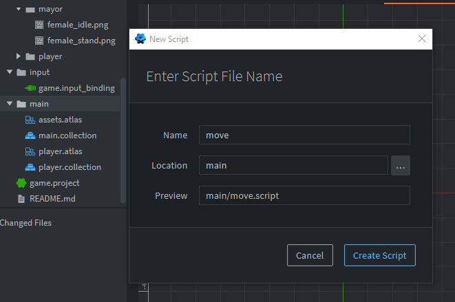

It will appear in the editor pane.
Paste the above code in.

From the player collection, add the script component file to the *player game-object*

*add component file*
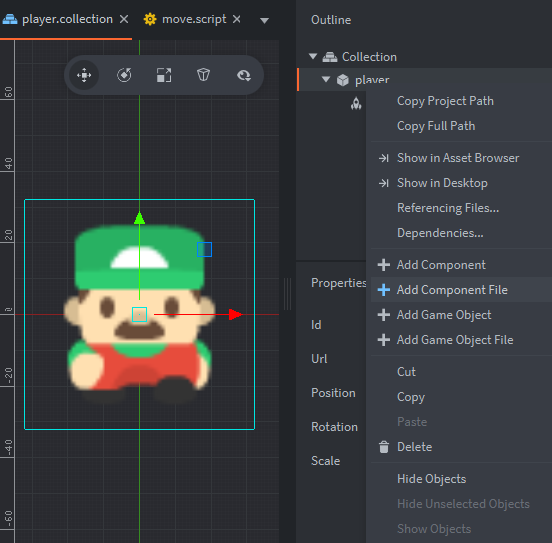

*select the script*
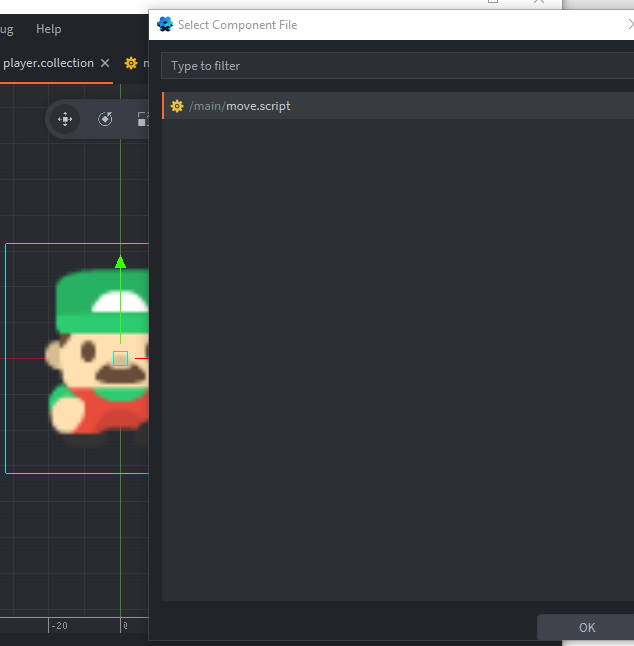

**SAVE it all with Ctrl-S**

### Lights **Camera** Action

If we ran the project now F5 or *Debug/Start* we would be dissapointed. We need to fix the camera as it is not pointing at anything useful.

As luck would have it - we can get the camera script and how to construct the camera from
https://defold.com/examples/render/camera/

+ open the main.collection add a game object and name it camera. add a camera component.
We want to attach a camera script so that we can tell it what to follow.

In the Assets pane right-click main and add a script. Name it camera.script

### **camera.script**

```
function init(self)
	msg.post("#camera", "acquire_camera_focus") -- <1>
end

function on_message(self, message_id, message, sender)
	if message_id == hash("follow") then -- <2>
		go.set_parent(".", sender) -- <3>
		go.set_position(vmath.vector3(-360, -360, 0)) -- <4>
	elseif message_id == hash("unfollow") then -- <5>
		go.set_parent("camera", nil, true)
	end
end

--[[
1. Acquire camera focus for the camera component. When a camera has focus it will send view and projection updates to the render script.
2. Start following the game object that sent the `follow` message.
3. This is done by parenting the camera component to the game object that sent the message.
4. Offset the camera so that it is centering on the game object (360 is half the screen width and height).
5. Stop following any game object. This is done removing the parent game object while maintaining the current world transform.
--]]

```

Add the camera component script to the camera game-object

Add this line to the player in the move script. no we wont leave it there. We will create a player script soon and move it there instead.

```
msg.post("/camera#camerascript", "follow")

```

Our message post address is different to the example because we have our player bound in a collection which changes its namespace.


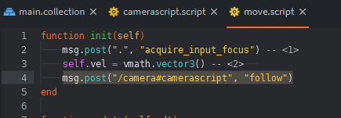

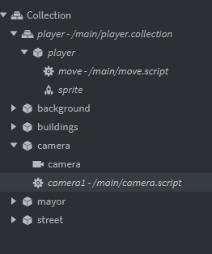


### **OK lets run it**
Save(Ctrl-S) and run (f5)

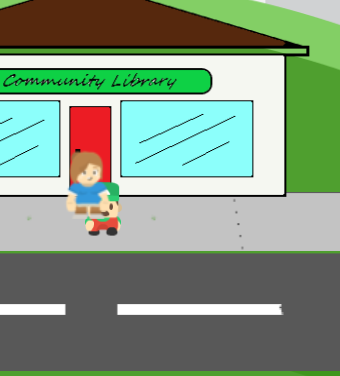

+ the player moves
+ the camera follows
+ the player is not animated
+ the player is always in-front or always behind the mayor when the player passes
+ the player can pass right through the mayor.
+ the mayor is blurry.
+ we can move off the edge of the screen.
+ we can't use point and click yet. (we may not get to this - its suprisingly difficult for a beginner, so I'll be trying all the options to find an easy way to make it work)

### **NEXT**
I do need to talk about what we have done so far. We will do that next session and if its quick we will take care of the things above too.

---


### Info in manual


+ In defold click help and then documentation
(or press F1)

+ 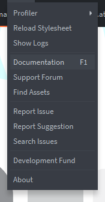

+ This opens the browser on defolds learn page - specifically manuals introduction.

Please read *Core Concepts*

**you can skip this for now**

The manual has very important and useful information. On the left is the manual menu.
 + Read *Core concepts* we cover this soon.
 + Read *Input* - well the first bit.
 + Look at examples and tutorials.
 + Note the forum where you can ask questions. Please look if the question has been asked and answered already, if not then go ahead and ask.


