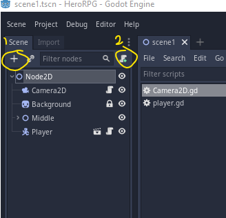
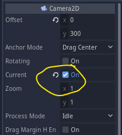
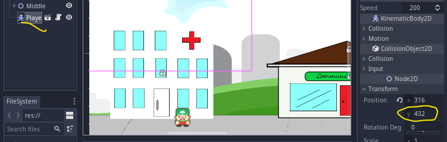
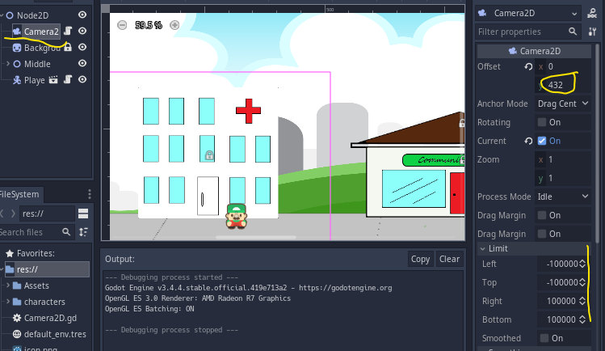
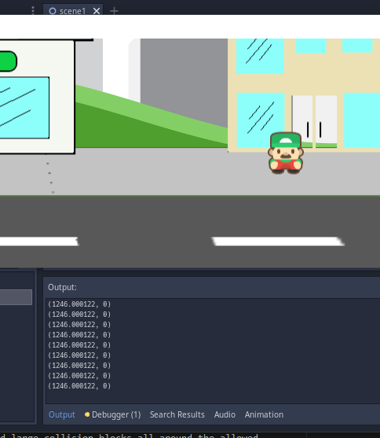
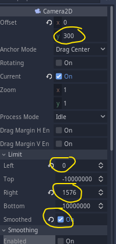
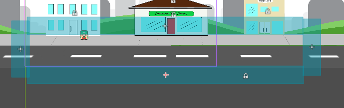
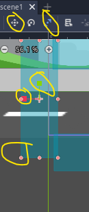
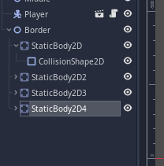
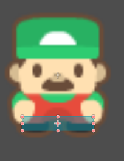

## Hero RPG a Role Playing Game, session 4


### Follow Camera

In 2D we get a default camera, but we want to use our own so we can modify it. We are going to add a camera and another script. 



Add *Camera2D* by clicking the plus and selecting the Camera2D option, then add the script.

*Note:* Set he new camera as the current camera. (panel 3) - notice the undo arrow on the changed settings.



Double-click on the script to open (script symbol next to the Camera2D node).

Replace the code with this

```
extends Camera2D
onready var player = get_node("/root/Node2D/Player")

func _ready():
	position.y = player.position.y
	

func _physics_process(_delta):
	position.x = player.position.x
	
```

This code
+ extends the camera
+ gets a reference to the Player object when it is ready and we can use the *player* variable to store that information instead of trying to find it later.
+ the *_physics_process* gives our new camera the same "x" position as the player each time it is called so it will follow the player left or right.

On the script page hold down the *Ctrl* key and move the mouse over the code. If you click while holding *Ctrl* you will be taken to the help pages for the item you clicked.

Save and run. When done, close the game window or click stop on the editor.

So we follow left and right - cool. We could set the camera Y to a specific position and remove the _ready function. Use the players Y if you want to do this. Mine is 432.


 


Note - the limits on the camera - a built in way to limit the camera
and also smoothing to prevent the camera follow *stuttering* and having the camera shake.

Lets change those.

```
#func _ready():
#	position.y = player.position.y

```

get rid of the y start as we set it in the editor.

Change *_physics_process* to this

```
func _physics_process(_delta):
	position.x = player.position.x
	print (position)
		
```


We can change it back as soon as we see where the camera should stop.

+ run the game. and squish the window so you can see the console (panel 4)
+ walk right and watch the position change from the player y position to around 1245




Stop the game. Using that value of x and the start value of x we can set our camera limits.

lets get rid of that print

```
#	print (position)

```

And I see the camera position is relative to the centre of the screen
So lets change the Camera Y as it is too low, and add the Limits. Finally turn on smoothing.



Save and run. Notice the camera only follows for part of the scene.
Quit game.


### No Code Borders (almost)

So we just need to add large collision blocks all around the allowed walking area. We dont want the player past the buildings and no further than this side of the street. We also want to prevent the player from walking past the edges of the scene, but up to the edges may be useful.
To stop the camera while the player moves to the edges we need to set camera limits on the x axis.

We want to have or Border look like this



Create a Node2D and call it Borders
Add a static body 2D under and give it a rectangle shape 2d
Nove it to the left and resize using the viewport toolbar and the draggy things.



Select the staticbody node and right click and duplicate OR select and *Ctrl D*




Move each one into place and resize.

Save and run the game.
We still have some Adjusting as we stay in the bounding box but we stop too soon. We need to only collide with the feet.

Lets change that as I have it completely backwards.

Quit the Game.
Lets adjust the collision shape.



Run and test again. Much better, we can walk up to the buildings now.

Next we will add a NPC character and make sure we can move around it without passing right through.


Quit & Save and if you used git, commit and push this session.

