## Godot, Hero RPG a Role Playing Game, session 2

Now its time to create the Hero.

A reminder for the editor.

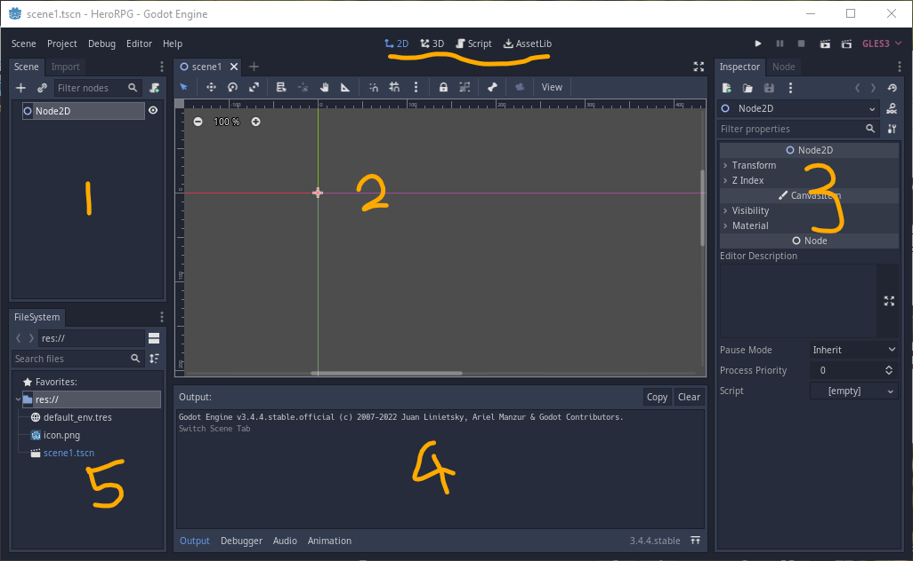

### Get assets

This time I'm going to grab the 2D character from Kenney's that can be used with flipbook animation. go to https://www.kenney.nl/assets and in the search type sokoban and hit the enter/return key on your keyboard.

Download the files. Extract. We will use the player png's from the kenney_sokobanpack\PNG\Default size\Player folder.

Drag (or copy paste) the player folder into your project. Make sure they end up in the assets folder.

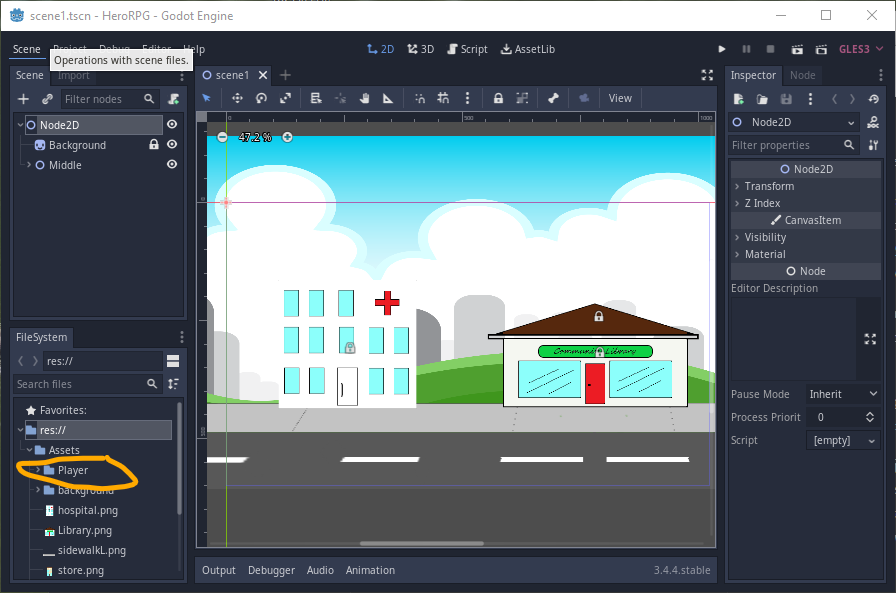

### Prefabs

For the player instead of just placing a sprite into the scene we are going to use an advanced feature. Engines like Unity refer to this as prefabs, to Godot this is just another scene which can be placed in the main scene.

Right click on res:// (panel 5) and create a new folder. Call it *characters*. then right click on characters and create another new folder. Call this one *player*. Now we have an organized place to keep player let's create the player.

Right click on player and click New Scene. 
Name it player. click create

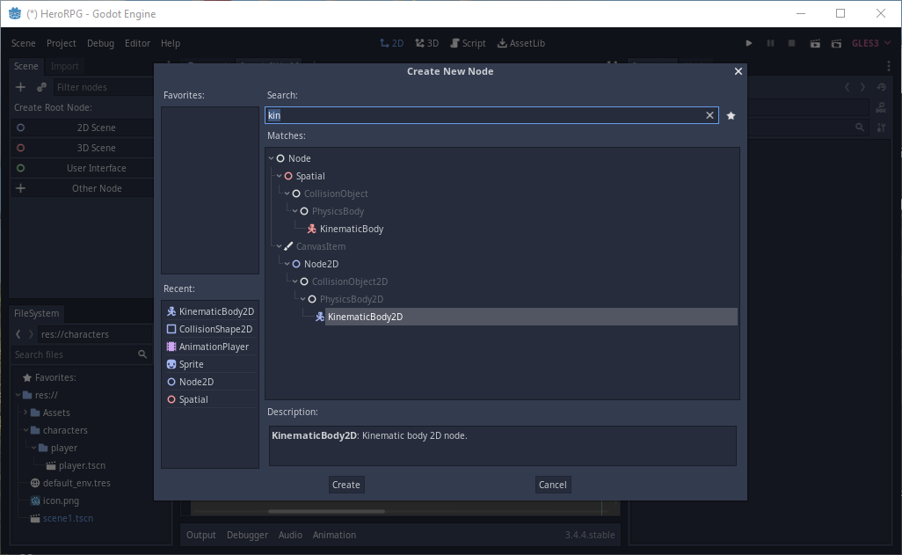

Click create.

If the player scene doesn't open, double click it to open.

        To open the Player scene. 
        Go to the file-system (bottom left or panel 5).
        Double click on the player scene. 

Just above the node 2D is a + symbol. Either you can click this OR right click on player and click New Scene. Choose Other node, and type *kine* and select *KinematicBody2D* (in panel 1) similar to what we did with the very first scene.

KinematicBody2D is often the correct choice for characters, but sometimes it's not. Knowing we can change the type of the node if we need to, we are going to move ahead with this choice.

#### Animated-Sprite Flip-book METHOD

With the root node selected Click the + again, this time type in *ani* and select AnimatedSprite and create.

In the same way, add a CollisionShape2D.
 
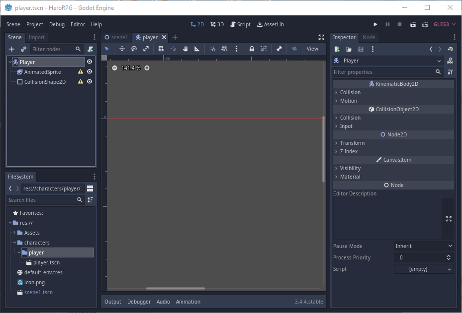

Start with AnimatedSprite. Click it. 
Look over at the Inspector (panel 3) and find animated sprite / frames.

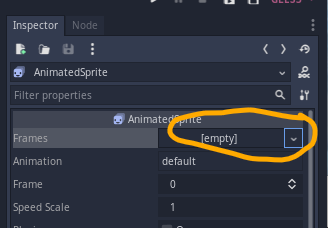

Click it and Click *New Spriteframes*. 

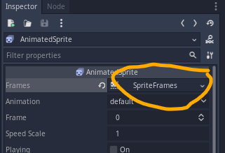

Now select sprite frames, so we can add our animations.

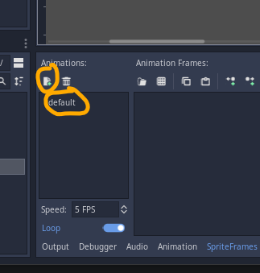

We want the player to walk *up* (north), *down* (south), and *left or right* (west or east). We also want a standing still animation *idle* (default)

We reuse the left_right animation by using flip H to flip the image horizontally.

Click default and type *idle* (can leave a default if you want)
Click the *New Animation* just above and add *left_right*, *up*, *down*.
(click to change names)

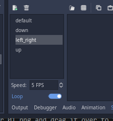

Press *Ctrl S* (save). this should be habit every few minutes and always save before running the app.

The Down animation need the player facing us. Right or Left foot first, then both feet, then the other foot, then both feet again.

Click down click the *Add texture from file* button. it'll start at res:// so navigate the Assets till we find our player images.

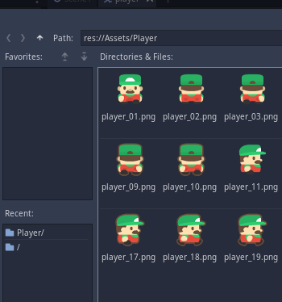

Then one at a time add
player_06.png
player_05.png
player_07.png
player_05.png
This starts us walking and ends with a stationary stance.
Turn loop off for down, up, left_right. Leave it on for default. We want the animation to stop when the character stops.

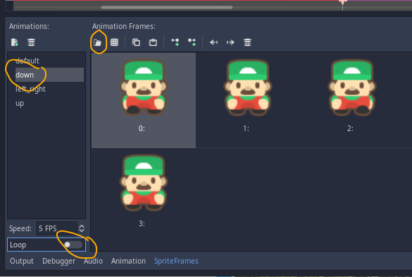

Do something similar for the other directions.
Use facing right for *left_right*.

Default (idle) could use player_05.png only unless you want the player to sway or breath.

Be consistent i.e. left, both, right, both OR right, both, left, both.

(you can drag the images if you need to adjust - or select image and press the bin to delete)

*Ctrl S* to save.

AND click the save to save the resource (below)

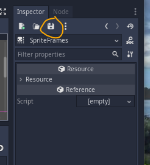

The yellow triangle is the collision shape complaining that it has no Shape yet.

Now click on the CollisionShape2D node and change the shape to New RectangleShape2D.

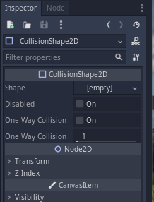

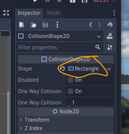

Now make sure you have the default animation selected - you will see the collision box

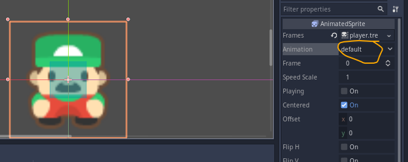

To resize the collision box be sure to select CollisionShape2D. and you will see the correct box to resize in the view screen.

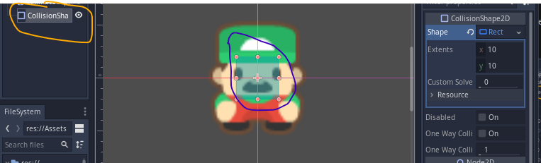

Drag the corner dots on the box (carefully) and extend/reduce them to be just less than the size of the sprite.

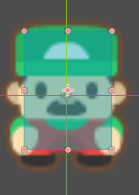

note I left space around the feet.

If you accidently drag anything else you should be able to undo with *Ctrl Z*

We need to take a break, so lets grab the player scene and drag it into the main scene.

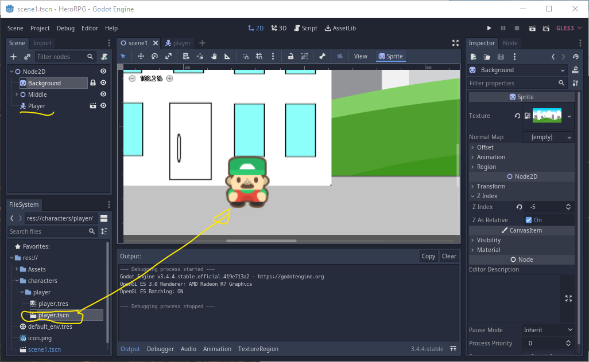

Then as we did in an earlier session lets run the game. push play.

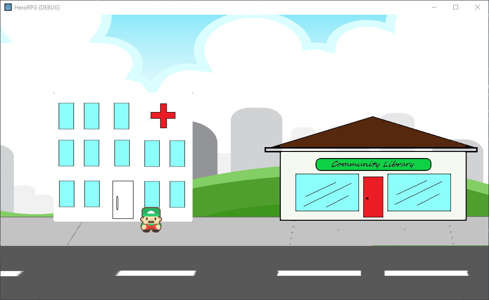

Ok - so nothing much happens.

#### Stuck?

*See* https://docs.godotengine.org/en/stable/tutorials/2d/2d_sprite_animation.html#individual-images-with-animatedsprite

#### Git

If you setup Git on this project then its time to commit and push. (commit often). If you are working with a community project they will have their own rules that you need to follow, but for your own projects we can learn as we go. The point now is to simply start using it to keep your work safe from all sorts of horrors.

#### Next

Next session we will try control the player with keyboard input. And discover a few surprising things.

